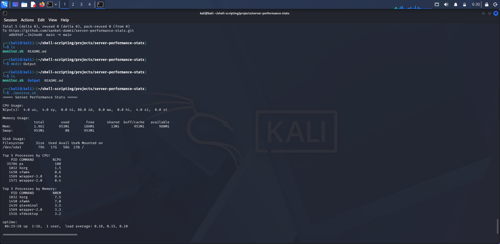

# server-performance-stats

Bash script to monitor basic server performance including CPU, memory, disk usage, and top processes.

---

## Features

- **CPU Usage** — Total usage percentage  
- **Memory Usage** — Free, used, and usage percentage  
- **Disk Usage** — Free, used, total, and usage percentage  
- **Top Processes** — Sorted by CPU and memory usage  
- **Uptime** — Human-readable system uptime  

---

## How to Run

```bash
git clone https://github.com/YOUR-USERNAME/server-performance-stats.git
cd server-performance-stats
chmod +x monitor.sh
./monitor.sh

## Sample Ouput 

===== Server Performance Stats =====

CPU Usage:
%Cpu(s):  4.0 us,  4.0 sy,  0.0 ni, 88.0 id,  0.0 wa,  0.0 hi,  4.0 si,  0.0 st 

Memory Usage:
               total        used        free      shared  buff/cache   available
Mem:           1.9Gi       953Mi       186Mi        13Mi       953Mi       980Mi
Swap:          953Mi          0B       953Mi

Disk Usage:
Filesystem      Size  Used Avail Use% Mounted on
/dev/sda1        79G   17G   58G  23% /

Top 5 Processes by CPU:
    PID COMMAND         %CPU
  35786 ps               100
   1032 Xorg             1.5
   1450 xfwm4            0.6
   1569 wrapper-2.0      0.4
   1571 wrapper-2.0      0.4

Top 5 Processes by Memory:
    PID COMMAND         %MEM
   1032 Xorg             7.5
   1450 xfwm4            7.0
   2439 qterminal        3.5
   1569 wrapper-2.0      3.3
   1516 xfdesktop        3.2

uptime:
 06:25:28 up  1:16,  1 user,  load average: 0.18, 0.15, 0.10

====================================



